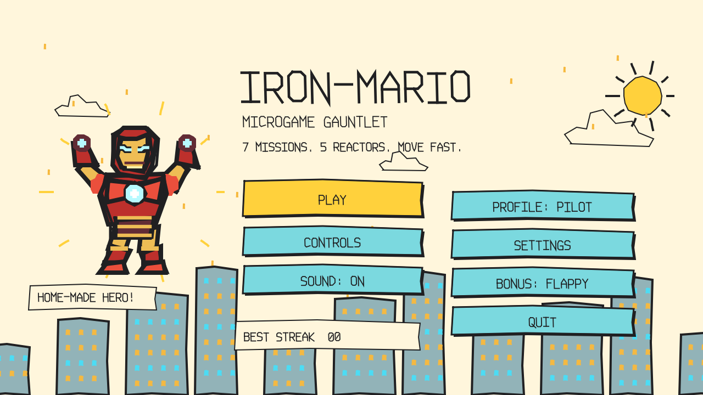
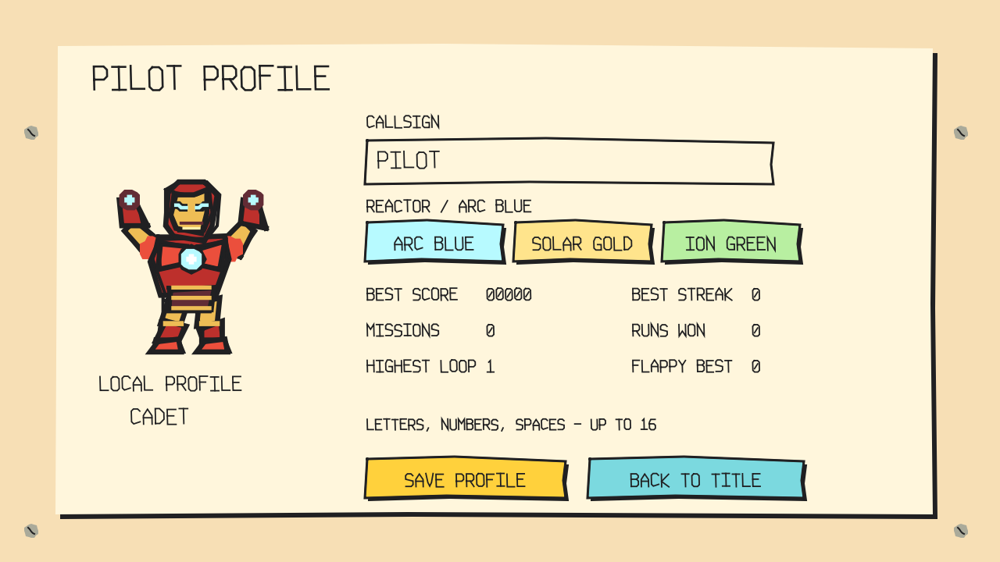
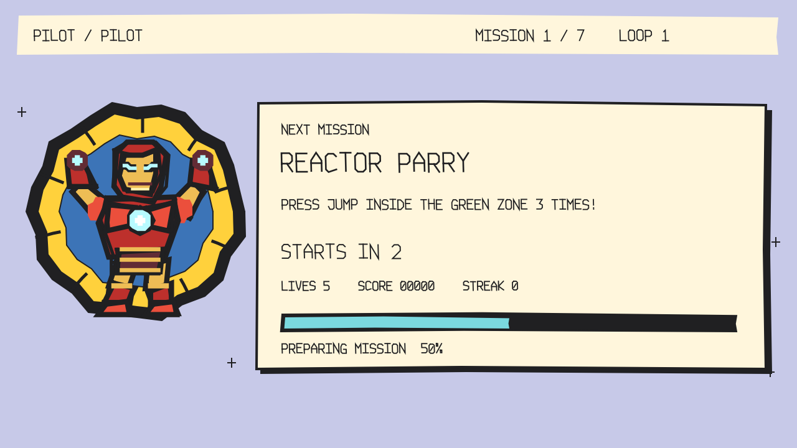

# Iron-Mario

Seven quick missions, five reactor lives, and a handmade armored hero who has to keep moving.

[Play in your browser](https://hustlenix.github.io/Iron-Mario/) · [Download a release](https://github.com/Hustlenix/Iron-Mario/releases/latest) · [Build status](https://github.com/Hustlenix/Iron-Mario/actions)



*The images here are rendered from the game's drawing commands. They are visual previews, not live gameplay screenshots.*

## Play

**Windows:** download the Windows ZIP from Releases, extract **everything**, and open `Iron-Mario.exe`. Keep `Iron-Mario.pck` in the same folder. You do not need Godot installed. Requires 64-bit Windows 10+ and an OpenGL 3.3-capable graphics driver. [Troubleshooting](docs/WINDOWS_README.txt).

**Browser:** open the play link above and click once to enable audio. Keyboard and mouse are recommended.

**From source:** import `project.godot` in Godot and press **F5**. The main scene is `scenes/title_screen.tscn`. Godot **4.4.1** is the tested build baseline; 4.7.1 remains a compatibility target, not a claimed test result.

## How a run works

Press **PLAY**. A three-second briefing shows the next mission's background, one-line objective, and preparation bar. The game loads the scene during that briefing and starts only when both the countdown and loading are complete.

Win to earn score and build your streak. A failed mission costs one reactor and stays in the queue for another attempt. Clear all seven to reach the ending; lose all five lives and the suit powers down. **HARDER MODE** starts another loop with faster hazards, tighter windows, or longer patterns.

The original project's five-life system is preserved.

## Controls

| Action | Control |
| --- | --- |
| Move | A / D or Left / Right |
| Jump, parry, sequence up | W / Space / Up |
| Sequence down | S / Down |
| Aim or drag parts | Left mouse button |
| Restart a mission | R |
| Select menus | Tab / arrows, then Enter |
| Start from title | E |
| Flappy thrust | W / Space / Up or left click |
| Flappy retry after a crash | R, jump, or left click |
| Leave Flappy | Escape |

## The seven missions

| Mission | Objective |
| --- | --- |
| Arc Reactor Dash | Jump between platforms and collect three shards. |
| Target Lock | Click five or six moving drones. |
| Laser Tunnel | Jump over the beams until time runs out. |
| Reactor Parry | Press jump inside the green zone three times. |
| Armor Repair | Drag three chips onto matching sockets. |
| Rocket Rescue | Catch five pods before missing three. |
| Power Core Sequence | Watch the arrow pattern and repeat it. |

Each mission lasts roughly 8–12 seconds. Successful inputs can finish a mission early.

## Bonus: Flappy flight

Fly through the pipe gaps, earn medals, and collect a shield that absorbs one pipe collision. The floor still ends your flight. The bonus is separate from the seven-mission gauntlet.

Flight runs on the physics tick. Pipe openings remain above the floor, and consecutive gaps stay within a bounded vertical distance. Keyboard and mouse use the same immediate flap input. Restart resets the pipes, trail, shield, and score. New records save after every point.

## Your pilot profile

Open **PROFILE** on the title screen to set a callsign and choose an arc-blue, solar-gold, or ion-green reactor. The profile shows your high score, best streak, missions cleared, runs won, highest loop with a clear, and Flappy record. Rank advances from Cadet to Defender to Ace as missions are cleared.

Everything is stored **locally on your device**. There is no sign-in or online leaderboard. Profiles and settings use `user://iron_mario_save.cfg`; existing best-streak, volume, and Flappy records migrate from the older `user://save.dat` without deleting it. New lifetime counters begin at zero because old saves did not record them. Browser and desktop profiles are separate.

Settings includes volume, mute, and **RESET PROGRESS**. Reset clears records while keeping your callsign, reactor color, and audio preferences.



## Art and loading screens

The suit has a gold faceplate, two illuminated eye slits, segmented red armor, shoulder plates, boot jets, palm repulsors, and a chest reactor. Idle, flight, damaged, and victory poses share the same drawing code.

The artwork keeps its MS Paint look: flat fills, uneven dark outlines, angular shapes, and handmade lettering. It is drawn programmatically, not claimed to be human-painted in Microsoft Paint. This is an unofficial fan-style game; Marvel's Iron Man and Nintendo's Mario belong to their respective owners. No official logos, extracted sprites, downloaded artwork, or asset packs are included.

Every mission has a different briefing backdrop: rooftops and shards, drone radar, a laser corridor, a reactor chamber, a repair bench, rescue-pod skies, or a sequence circuit. The bar measures **mission preparation**: both the three-second briefing and real resource readiness. It is not a fake download percentage.



Sounds are original synthesized effects. The original generated title music and bonus audio are retained; the WAV generator is `tools/gen_audio.ps1`.

## Endings

**Mission Complete:** the hero celebrates above the city with reactor light and confetti. The screen shows score, streak, and loop, with Play Again, Harder Mode, and Back to Title.

**Suit Powered Down:** the reactor flickers and powers down. The screen shows score and completed missions, with Try Again and Back to Title.

## Project structure

| File or directory | Responsibility |
| --- | --- |
| `scripts/Global.gd` | Run state, input actions, local profile, settings, save migration |
| `scripts/GameManager.gd` | Shuffled mission queue, scoring flow, scene transitions |
| `scripts/MiniGameBase.gd` | Shared timer, HUD, win/loss signals, restart |
| `scripts/Intermission.gd` | Threaded scene preparation, countdown, progress display |
| `scripts/ui/MissionBackdrop.gd` | Seven briefing environments |
| `scripts/ProfileScene.gd` | Editable callsign, reactor choice, saved records |
| `scripts/ui/IronHero.gd` | Shared suit artwork and poses |
| `scripts/ui/Paint.gd` | Drawing style and stroke lettering |
| `scripts/minigames/` | Seven mission implementations |
| `scenes/flappy_bird.gd` | Bonus flight mechanics |
| `tools/` | Runtime checks and preview generation |

The original four-game scenes remain for compatibility and reference. The title's Play button uses the shared seven-game system.

## Build and test

Install the matching Godot export templates. On Windows PowerShell, from the project folder:

```powershell
godot --path .
New-Item -ItemType Directory -Force build/windows, build/linux, build/web
godot --headless --path . --export-release "Windows Desktop" build/windows/Iron-Mario.exe
godot --headless --path . --export-release "Linux" build/linux/Iron-Mario.x86_64
godot --headless --path . --export-release "Web" build/web/index.html
python -m http.server 8000 --directory build/web
```

Open `http://localhost:8000` for the exported browser version. Serve it over HTTP rather than opening the HTML file directly. The Web preset is single-threaded and needs no cross-origin isolation headers. Native exports use unmodified Godot executables with a separate PCK; never patch an executable to update the game data.

```text
python tools/validate_project.py
python tools/check_engine.py /path/to/godot
python tools/check_engine.py build/windows/Iron-Mario.exe --exported
```

GitHub Actions runs mechanics and scene checks on Linux and Windows, tests the exported executables, and publishes the Web preview only after the checks pass. [Verification scope](docs/TEST_REPORT.md). Headless tests do not claim human audio, keyboard, or graphics-driver validation.

## Development log

[DEVELOPMENT_LOG.md](DEVELOPMENT_LOG.md) contains a planned **16.5-hour scope**, approximately 16 hours, with blank actual-time fields. Record real development sessions before submitting. Planned hours and AI runtime are not claims of human coding time.

## Credits

- Project owner: Hemanathan SV / Hustlenix.
- Engine: [Godot](https://godotengine.org/).
- Pacing inspiration: the WarioWare microgame genre and [Goose Games by gabl18](https://gabl18.itch.io/goose-games).
- The original prototype acknowledged the “How to Make Your First WarioWare-style Game” tutorial.
- Character inspirations belong to their respective owners; this project is not affiliated with or endorsed by them.

## AI-use disclosure

AI assistance contributed code, debugging, procedural artwork, test tooling, and documentation. The project owner should review the work, make the final creative decisions, and record their own actual development time honestly.
